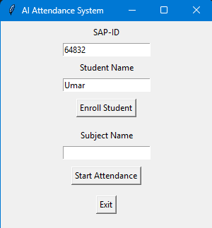
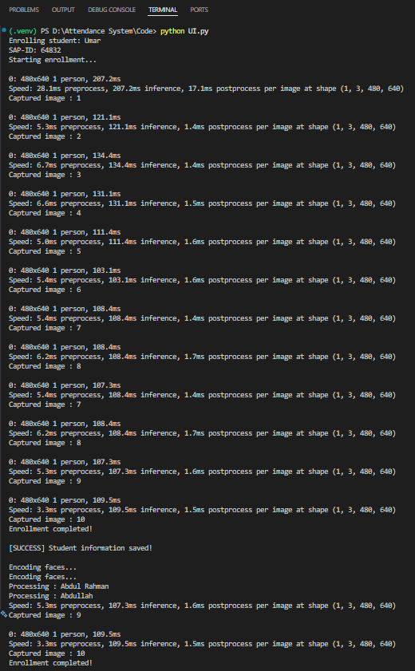
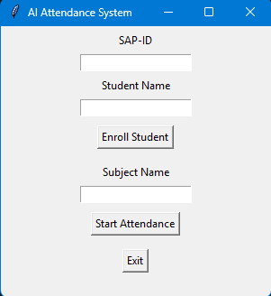
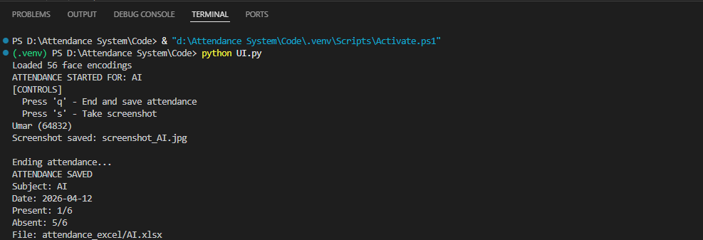
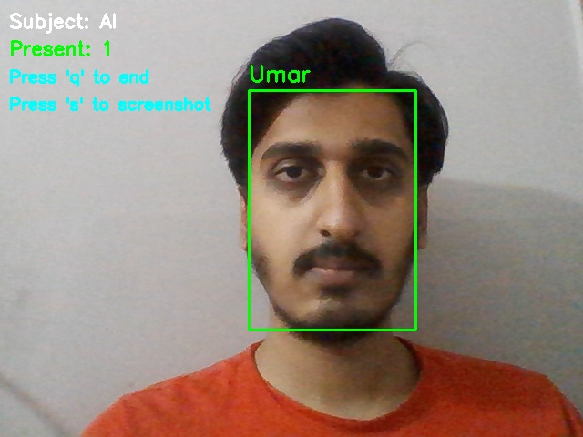

# AI Attendance System

An AI-powered desktop attendance system that automates student enrollment, face detection, face recognition, and attendance marking through a simple Python application.

This project combines computer vision and machine learning to reduce manual attendance work and generate structured attendance records for different subjects.

## Features

- Student enrollment with webcam image capture
- Automatic face encoding generation
- Real-time face detection and recognition
- Attendance marking by subject
- Excel export for attendance records
- Simple desktop interface built with Tkinter
- Basic evaluation script for recognition performance

## Workflow

1. Enroll a student and capture face images from webcam.
2. Store the student's SAP ID and dataset images.
3. Generate face encodings from the enrolled dataset.
4. Start attendance for a selected subject.
5. Detect and recognize faces in real time.
6. Mark recognized students present and export attendance to Excel.

## Tech Stack

- Python
- OpenCV
- face_recognition
- dlib
- Ultralytics YOLOv8 Face
- NumPy
- Pandas
- OpenPyXL
- Scikit-learn
- Matplotlib
- Seaborn
- Tkinter

## Project Structure

```text
Attendance System/
|-- Code/
|   |-- UI.py
|   |-- index.py
|   |-- enroll.py
|   |-- recognize.py
|   |-- encode_faces.py
|   |-- attendance.py
|   |-- evaluation.py
|   |-- config.py
|   `-- requirements.txt
`-- Project_SS/
    |-- Attendance/
    `-- Enrollment/
```

## Setup

1. Create and activate a Python virtual environment.
2. Install dependencies:

```bash
pip install -r Code/requirements.txt
```

3. Download the YOLO model files if they are not already present:

- `yolov8n.pt`
- `yolov8n-face.pt`

4. Run the desktop UI:

```bash
python Code/UI.py
```

## How It Works

### Enrollment

- Capture student face images from webcam
- Save images inside a student folder
- Store SAP ID in `info.txt`
- Generate face encodings for recognition

### Attendance

- Detect faces in webcam frames using YOLOv8 face detection
- Recognize faces against enrolled encodings
- Mark students present once per session
- Export attendance to Excel by subject

## Core Modules

- `UI.py`: Tkinter-based desktop interface
- `enroll.py`: student enrollment and dataset collection
- `encode_faces.py`: face encoding generation from dataset images
- `recognize.py`: face recognition logic with configurable match tolerance
- `index.py`: real-time attendance flow using webcam input
- `attendance.py`: attendance export and subject-wise record management
- `evaluation.py`: recognition performance analysis

## Important Privacy Note

This project uses face images and derived face encodings. Do not upload private student datasets or generated biometric encodings to a public repository.

Recommended exclusions:

- `Code/dataset/`
- `Code/encodings.pickle`
- `Code/attendance_excel/`

## Future Improvements

- Multi-frame confirmation before marking attendance
- Liveness detection to reduce spoofing
- Confidence calibration and false-positive reduction
- Database integration
- Web dashboard and analytics
- Role-based access control
- Cloud deployment

## Screenshots

### Enrollment UI



### Enrollment Information



### Attendance UI



### Attendance Process



### Attendance Screenshot



### Excel Output


## Author

Name: Umar Awais Tayyab
LinkedIn: https://www.linkedin.com/in/umar-awais-ab3837318/
GitHub: https://github.com/umar967
